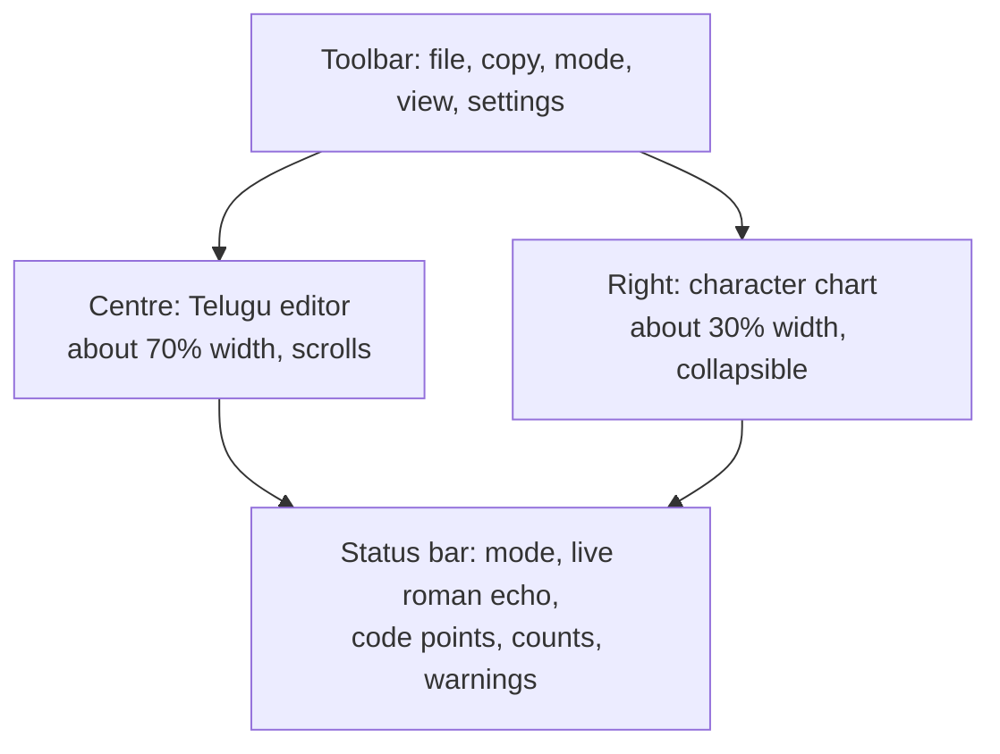
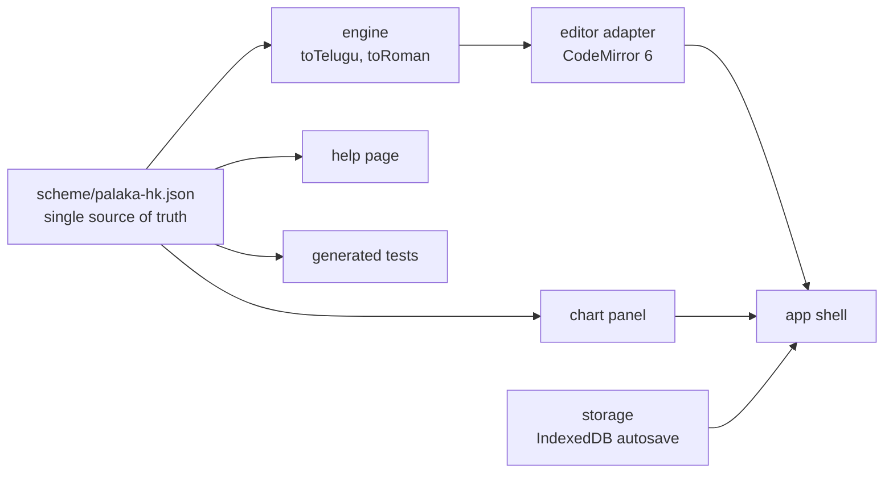

# పలక! (Palaka) — Development Plan

2026-09-20 · @Someone

## 1. Vision and design principles

Palaka is a browser-based Telugu writing slate: you type roman letters in a modified Harvard-Kyoto scheme, and exact, predictable Telugu Unicode appears in a large central editor. A permanent chart on the right shows every Telugu letter with its roman key, arranged in the traditional varnamala order, so the writer never has to guess.

The name fits the purpose. A palaka is the slate on which children first learn their letters; this app is the slate for the computer.

Five principles govern every design decision below.

1. **No ambiguity.** One roman sequence gives exactly one Telugu output, and every Telugu text converts back to exactly one roman sequence. No dictionary guessing, no word prediction that changes letters, no context-dependent surprises.
2. **The chart is the contract.** What the right-hand chart shows is exactly what the engine does. Both are generated from one mapping file, so they cannot drift apart.
3. **Plain-ASCII typing.** Every letter is reachable from a standard English keyboard with no diacritics, no special layout, and no installation.
4. **Text-first, offline-first.** It is a static web page that works without a server or an internet connection. The writer's text never leaves the computer.
5. **Small and maintainable.** The transliteration engine is a pure, framework-free module with a full test suite. The user interface is a thin layer around it.

## 2. Encoding scheme: Palaka-HK

Palaka-HK is standard Harvard-Kyoto plus four Telugu extensions: short and long e/o, `L` for ళ, an `x` suffix for variant letters, and two control keys. Anyone who knows HK can type immediately; the extensions cover what Sanskrit-oriented HK lacks.

The scheme is case-sensitive. Lower case is the short or plain sound and upper case is the long, retroflex or special sound, which is the HK habit extended consistently.

### Vowels (అచ్చులు)

| Key | Letter | Vowel sign | Note |
| --- | --- | --- | --- |
| a | అ | (inherent) |  |
| A | ఆ | ా |  |
| i | ఇ | ి |  |
| I | ఈ | ీ |  |
| u | ఉ | ు |  |
| U | ఊ | ూ |  |
| R | ఋ | ృ |  |
| RR | ౠ | ౄ |  |
| lR | ఌ | ౢ | rare |
| lRR | ౡ | ౣ | rare |
| e | ఎ | ె | Extension: short e (HK has only one e) |
| E | ఏ | ే | Extension: long e |
| ai | ఐ | ై |  |
| o | ఒ | ొ | Extension: short o |
| O | ఓ | ో | Extension: long o |
| au | ఔ | ౌ |  |

### Consonants (హల్లులు), in varga order

| Group | 1 | 2 | 3 | 4 | 5 |
| --- | --- | --- | --- | --- | --- |
| Velar | k క | kh ఖ | g గ | gh ఘ | G ఙ |
| Palatal | c చ | ch ఛ | j జ | jh ఝ | J ఞ |
| Retroflex | T ట | Th ఠ | D డ | Dh ఢ | N ణ |
| Dental | t త | th థ | d ద | dh ధ | n న |
| Labial | p ప | ph ఫ | b బ | bh భ | m మ |

| Key | Letter | Note |
| --- | --- | --- |
| y | య |  |
| r | ర |  |
| l | ల |  |
| v | వ |  |
| z | శ | standard HK |
| S | ష |  |
| s | స |  |
| h | హ |  |
| L | ళ | Extension, follows the common HK convention for ḷa |
| rx | ఱ | Extension: banDi ra |
| kS | క్ష | ordinary conjunct, shown in the chart for convenience |
| jJ | జ్ఞ | ordinary conjunct, shown in the chart for convenience |

### Signs, controls and rare letters

| Key | Output | Meaning |
| --- | --- | --- |
| M | ం | anusvara (sunna) |
| H | ః | visarga |
| Mx | ఁ | arasunna (candrabindu) |
| ' | ఽ | avagraha |
| \| | । | danda; two in a row give the double danda ॥ |
| ^ | U+200C | zero-width non-joiner: keeps the visible pollu instead of forming a conjunct |
| \_ | nothing | break key: splits a sequence that would otherwise merge |
| cx | ౘ | historic tsa |
| jx | ౙ | historic dza |
| Lx | ఴ | LLLA, used for Tamil ழ |
| nx | ౝ | nakaara pollu |

The letter `x` has no sound of its own; it only ever marks a variant of the key before it. That makes the extensions collision-free, and leaves room to add letters later without breaking old text.

The two control keys remove the last ambiguities HK leaves open. `a_i` gives అఇ while `ai` gives ఐ; `k_h` gives క్హ while `kh` gives ఖ; `l_R` gives లృ while `lR` gives ఌ.

### Worked examples

| Typed | Result |
| --- | --- |
| palaka | పలక |
| telugu | తెలుగు |
| dEzaM | దేశం |
| kRSNa | కృష్ణ |
| jJAnaM | జ్ఞానం |
| gurraM | గుర్రం |
| ceTTu | చెట్టు |
| sAphT^vEr | సాఫ్ట్‌వేర్ |

Digits stay as 0–9 by default, as in modern printed Telugu; a setting switches them to ౦–౯. English text is typed inside backticks, or by toggling the input mode with a shortcut.

## 3. Transliteration engine

The engine is two pure functions, `toTelugu(roman)` and `toRoman(telugu)`, driven entirely by one mapping file. It has no dependency on the browser, so it can be tested from the command line and reused later in a browser extension or a desktop tool.

### Forward rules (roman to Telugu)

1. **Longest match first.** At each position the tokenizer takes the longest key in the map: `lRR` before `lR` before `l`, `kh` before `k`, `ai` before `a`, `rx` before `r`.
2. **Consonant state.** After a consonant the engine is in a pending state. A following vowel key writes the vowel sign (or nothing for `a`). A following consonant writes a virama first, which forms the conjunct. Anything else, including end of word, writes a virama, giving the pollu form.
3. **Vowel state.** A vowel key at the start of a word, or after another vowel or sign, writes the independent letter.
4. **Signs** (`M`, `H`, `Mx`) attach to the syllable before them and close it.
5. **Break key `_`** closes the current token and outputs nothing. **`^`** closes the token and outputs a zero-width non-joiner.
6. **Pass-through.** Any character not in the map (spaces, punctuation, digits, unknown letters such as `f`, `q`, `w`) is copied unchanged and flagged in the status bar, never silently dropped.
7. **Literal spans.** Text between backticks is copied unchanged, with the backticks removed.

### Reverse rules (Telugu to roman)

`toRoman` walks the Telugu text cluster by cluster and emits the canonical key for each letter. It inserts `_` only where the plain output would be re-read differently, for example అఇ becomes `a_i`, and it wraps runs of Latin letters in backticks. The guarantee to test is the round trip: `toTelugu(toRoman(t))` equals `t` for any normalised Telugu text.

### Live typing

The editor holds Telugu text only. While the user types, the engine keeps a short roman buffer for the syllable in progress and re-renders just that syllable on each keystroke, so `k` shows క్, then `kh` shows ఖ్, then `khA` shows ఖా. The buffer ends on a space, punctuation, a cursor move, a click, or a paste.

Backspace removes one roman keystroke while the buffer is alive, and one Unicode code point afterwards, so a vowel sign can be deleted without losing its consonant.

### Edge cases the agent must handle

- Input is normalised to NFC on paste and on file open; the deprecated two-part forms are never produced.
- The text field sets `autocapitalize=off`, `autocorrect=off` and `spellcheck=false`, because the scheme is case-sensitive and a phone keyboard that capitalises the first letter would change అ into ఆ.
- Caps Lock is detected and shown as a warning in the status bar.
- A system Telugu keyboard or IME composition event is passed through untouched, so Palaka does not fight another input method.
- Undo and redo work by whole syllable, not by keystroke.

## 4. Screen layout and editor behaviour

The screen has four fixed regions: a slim toolbar on top, the editor in the centre, the character chart on the right, and a status bar at the bottom.



### Centre editor

The editor is a large plain-text area in a good Telugu font at a comfortable default size of about 20 px, with generous line height so that vowel signs and stacked conjuncts are never clipped. It scrolls independently, accepts pasted text from anywhere (formatting stripped, text normalised), and supports the usual selection, cut, copy, undo and redo.

An optional split view shows the roman source of the same text in a second pane below the editor. Both panes are editable and stay in sync, which makes it easy to fix a word by editing its roman spelling.

### Right-hand character chart

The chart is generated from the mapping file and laid out in the traditional order: vowels, then vowel signs, then the five vargas as a 5 by 5 grid, then the remaining consonants, then signs and rare letters. Each tile shows the Telugu letter large and its roman key beneath it in a monospace font.

- Clicking a tile inserts that letter at the cursor, so the chart doubles as an on-screen keyboard.
- While typing, the tile for the key just pressed lights up, which teaches the scheme as you write.
- Selecting a consonant tile opens its guninta row (క కా కి కీ …) with the roman spelling of each.
- Placing the cursor on a letter in the editor highlights its tile, and the status bar shows its roman key and Unicode code points.
- A search box filters the chart by roman key or by Telugu letter.

On narrow screens the chart becomes a drawer that slides up from the bottom.

### Toolbar and status bar

The toolbar holds New, Open, Save, Copy all, the Telugu/English mode switch, the split-view switch, font size, theme and Help. The status bar shows the current mode, the live roman echo of the syllable being typed, the code points under the cursor, character and word counts, and any warnings such as Caps Lock or an unmapped key.

## 5. Features by priority

Version 1 is the first ten rows: a dependable typing slate. The rest are additions that fit the same purpose without compromising the no-ambiguity rule.

| Priority | Feature | Why it helps |
| --- | --- | --- |
| Must | Live Palaka-HK typing in the centre editor | the core purpose |
| Must | Right-hand chart in traditional order, click to insert, live key highlight | removes guessing; doubles as a keyboard |
| Must | Paste from anywhere, with clean-up and NFC normalisation | mixed sources are the usual cause of broken Telugu text |
| Must | Reverse conversion: select Telugu, see or copy its roman spelling | verify exactly what is encoded |
| Must | Telugu/English mode switch and backtick literals | real documents mix scripts |
| Must | Autosave to the browser, with restore after a crash or a closed tab | never lose writing |
| Must | Open and save `.txt` files in UTF-8; Copy all | get text in and out |
| Must | Status bar with roman echo, code points, counts and warnings | encoding transparency |
| Must | Works offline as an installable web app | no server, no dependence on a connection |
| Must | Built-in help page with the full scheme and examples | self-contained |
| Should | Split view with editable, synchronised roman source | fix words by their spelling |
| Should | Guninta pop-up for each consonant | learning aid |
| Should | Text inspector: show hidden characters (ZWNJ, ZWJ, stray viramas, mixed-script look-alikes) | finds the invisible faults in pasted text |
| Should | Find and replace that accepts either Telugu or roman input | fast editing |
| Should | Multiple documents in a simple sidebar list | everyday use |
| Should | Light and dark themes, font choice, font size | comfort for long writing |
| Should | Bulk convert: paste a block of Palaka-HK text and convert it at once | reuse text typed elsewhere |
| Later | Import from other schemes (ITRANS, ISO 15919, RTS) into Palaka-HK | migrate old material |
| Later | Export to `.docx`, `.pdf` and `.html` | sharing |
| Later | Practice mode: shows a word, checks the typed spelling | teaching the scheme |
| Later | Conversion of legacy non-Unicode font text (Anu and similar) | rescue old documents |
| Later | The same engine packaged as a browser extension | type Palaka-HK in any web page |

Deliberately excluded: dictionary-based word prediction and phonetic guessing. They are the source of the ambiguity Palaka exists to remove.

## 6. Architecture and tech stack

Palaka is a static, client-only web app in TypeScript, built with Vite, with the editor on CodeMirror 6 and no server at all. The rule for maintainability is one source of truth: the mapping file feeds the engine, the chart, the help page and the tests.



| Concern | Choice | Reason |
| --- | --- | --- |
| Language | TypeScript, strict mode | the mapping and engine states are typed, which catches mistakes early |
| Build | Vite | fast, simple, static output that hosts anywhere |
| Editor | CodeMirror 6 | reliable undo, large documents, mobile and IME handling, custom key handling, decorations for the inspector |
| UI layer | plain TypeScript with small components, or Preact if the agent prefers | the UI is small; avoid a heavy framework |
| Styling | plain CSS with custom properties | themes without a build step |
| Fonts | Noto Sans Telugu and Noto Serif Telugu, bundled locally; user may pick an installed font | works offline, consistent rendering |
| Storage | IndexedDB for documents and autosave; localStorage for settings | survives restarts, no server |
| Offline | service worker and web manifest through vite-plugin-pwa | installable, offline |
| Tests | Vitest for the engine, fast-check for round-trip properties, Playwright for typing in a real browser | see section 7 |
| Hosting | any static host, for example GitHub Pages | free and simple |

### Folder layout

```
palaka/
  scheme/palaka-hk.json      mapping: key, letter, sign, group, order, notes
  src/engine/                pure functions, no DOM: tokenizer, toTelugu, toRoman, normalise
  src/editor/                CodeMirror setup, live-typing input handler, inspector
  src/chart/                 chart panel, guninta pop-up, search
  src/app/                   shell, toolbar, status bar, settings, storage
  src/help/                  help page generated from the mapping
  tests/golden/              word lists: roman, tab, expected Telugu
  tests/engine/, tests/e2e/
  docs/SCHEME.md, docs/ARCHITECTURE.md, CHANGELOG.md, CLAUDE.md
```

### Maintenance rules

- The mapping file carries a version number. A key, once published, never changes meaning; new letters only take unused keys.
- A build-time check fails if two keys collide, if a letter has two canonical keys, or if any entry breaks the round trip.
- The engine has no imports from the editor or the app, enforced by a lint rule.
- Adding a letter is a one-line change to the mapping plus one golden test line; nothing else needs editing.
- `CLAUDE.md` at the repository root records these rules so any future agent session follows them.

## 7. Testing and quality

The engine is only trustworthy if its behaviour is pinned down by tests, so the tests are written before the user interface. Four layers cover it.

1. **Golden word list.** A plain text file of at least 300 pairs, roman and expected Telugu, covering every key, every vowel sign on at least one consonant, common conjuncts (క్ష, జ్ఞ, త్ర, స్త్ర, ర్ర), word-final pollu, ZWNJ loan words, `_` breaks and mixed English. Bhanu reviews this list by eye once; after that it guards every change.
2. **Round-trip property test.** Random valid Telugu strings must satisfy `toTelugu(toRoman(t)) = t`, and random valid key sequences must convert without error.
3. **Mapping validation.** The build fails on key collisions, duplicate canonical keys or entries missing from the chart.
4. **Browser typing tests.** Playwright types real keystrokes, including backspace mid-syllable, cursor moves, paste, undo and the mode switch, and compares the editor content.

Quality checks beyond correctness: the chart and toolbar are fully usable from the keyboard, tiles have readable labels for screen readers, colour contrast meets WCAG AA in both themes, a 100,000-character document still types without visible lag, and the app is verified in current Chrome, Firefox, Edge and Safari plus one Android phone.

Continuous integration runs lint, type-check, all tests and a production build on every push.

## 8. Milestones

Seven phases, numbered 0 to 6, each ending in something that runs and can be checked before the next begins. Tell the agent to stop at the end of each phase for review.

| Phase | Builds | Done when |
| --- | --- | --- |
| 0. Scaffold | Vite and TypeScript project, lint, test runner, CI, `CLAUDE.md`, empty folder layout | `npm test` and `npm run build` pass on an empty app |
| 1. Scheme and engine | `palaka-hk.json`, tokenizer, `toTelugu`, `toRoman`, normaliser, mapping validation, golden list, property tests | all golden pairs and round-trip tests pass from the command line |
| 2. Editor | CodeMirror editor, live-typing handler, backspace and undo by syllable, mode switch, backtick literals, paste clean-up | the Playwright typing tests pass; typing the worked examples in section 2 gives the expected text |
| 3. Chart and status bar | generated chart in traditional order, click to insert, key highlight, cursor-to-tile highlight, guninta pop-up, search, status bar | every key in the mapping appears once in the chart; clicking any tile inserts the right letter |
| 4. Documents and offline | autosave, open and save `.txt`, copy all, multiple documents, settings, themes, fonts, installable offline app | text survives a closed tab; the app loads with the network switched off |
| 5. Verification tools | split roman view, reverse conversion of a selection, text inspector, find and replace, bulk convert, help page | pasted faulty text shows its hidden characters; editing the roman pane updates the Telugu pane |
| 6. Polish and release | accessibility pass, mobile drawer layout, performance check, README, scheme documentation, deployment | checklist in section 7 passes; site is live on the static host |

## 9. Master prompt for agentic mode

Paste the block below as the first message of the agentic session, with this document attached or saved in the repository as `docs/PLAN.md`. It is your original brief, tightened and made testable.

```markdown
Build "పలక!" (Palaka), a web app for writing and editing Telugu on a computer.

PURPOSE
Telugu typing tools guess. Palaka does not. The writer types roman letters in a
fixed scheme called Palaka-HK (Harvard-Kyoto with Telugu extensions) and gets
exact, predictable Telugu Unicode. One key sequence always gives one output,
and any Telugu text converts back to one roman spelling.

LAYOUT
- Centre: a large scrolling plain-text Telugu editor. It supports typing,
  pasting from anywhere, selection, cut, copy, undo and redo.
- Right: a permanent character chart showing every Telugu letter with its
  roman key, in traditional varnamala order (vowels, vowel signs, the five
  vargas as a 5x5 grid, other consonants, signs). Tiles insert on click and
  light up as their key is typed.
- Top: slim toolbar. Bottom: status bar with mode, live roman echo, Unicode
  code points under the cursor, counts and warnings.

HARD RULES
1. scheme/palaka-hk.json is the single source of truth. The engine, the chart,
   the help page and the mapping tests are all generated from it.
2. The engine (src/engine) is pure TypeScript with no DOM and no imports from
   the UI. It exports toTelugu(roman) and toRoman(telugu).
3. Tokenise by longest match. Consonant + vowel gives the vowel sign; consonant
   + consonant gives a conjunct through virama; a consonant followed by anything
   else gets a visible virama. "_" breaks a token and outputs nothing. "^"
   outputs ZWNJ. Text inside backticks passes through unchanged.
4. toTelugu(toRoman(t)) must equal t for all NFC Telugu text. Prove it with
   property tests.
5. No dictionary, no prediction, no phonetic guessing, no network calls. The
   app is static, works offline and stores everything in the browser.
6. Unmapped characters pass through unchanged and raise a status-bar warning.
7. The editor field disables autocapitalize, autocorrect and spellcheck, and
   leaves IME composition events alone.

STACK
TypeScript (strict), Vite, CodeMirror 6, plain CSS, IndexedDB, vite-plugin-pwa,
Vitest, fast-check, Playwright. Bundle Noto Sans Telugu and Noto Serif Telugu.

PROCESS
- Follow docs/PLAN.md: the mapping tables in section 2, engine rules in
  section 3, layout in section 4, feature priorities in section 5,
  architecture in section 6, tests in section 7.
- Work through the phases in section 8 in order. Write the tests for a phase
  before its code. At the end of each phase run lint, type-check, tests and
  build, summarise what was done, and stop for my review.
- Start with Phase 0 and Phase 1 only. Show me the generated mapping file and
  the golden word list before building any user interface.
- Create CLAUDE.md recording the hard rules and the maintenance rules, and keep
  docs/SCHEME.md and CHANGELOG.md current.
- If anything in the plan is unclear or two rules conflict, ask me instead of
  guessing. I am a native Telugu reader and will verify the output by eye.
```

## 10. Open decisions

Each item has a proposed default already written into the plan; change any of them here before starting and the agent will follow.

- [x] **Short and long e/o.** Proposed: `e` ఎ, `E` ఏ, `o` ఒ, `O` ఓ, matching the a/A pattern. The alternative keeps HK's `e` and `o` as the long vowels and finds other keys for the short ones, which suits Sanskrit text but not everyday Telugu.
- [x] **Key for ఱ.** Proposed: `rx`. `rr` is not available because it must give ర్ర, as in గుర్రం, and `rR` must give రృ, as in నిరృతి.
- [x] **Key for arasunna ఁ.** Proposed: `Mx`. An alternative is `~`.
- [x] **Convenience aliases.** Proposed: none in version 1. Candidates for later are `f` for ఫ and `w` for వ; aliases affect typing only, since reverse conversion always gives the canonical key.
- [x] **Digits.** Proposed: 0–9 stay as they are, with a setting for ౦–౯.
- [x] **Mode-switch shortcut.** Proposed: Ctrl+Space, configurable, because some systems reserve that combination.
- [x] **Editor component.** Proposed: CodeMirror 6. A plain textarea is simpler but makes syllable-level undo, the inspector and large documents much harder.
- [x] **Hosting and licence.** Proposed: GitHub Pages and an open-source licence such as MIT, so others can adopt the scheme.
